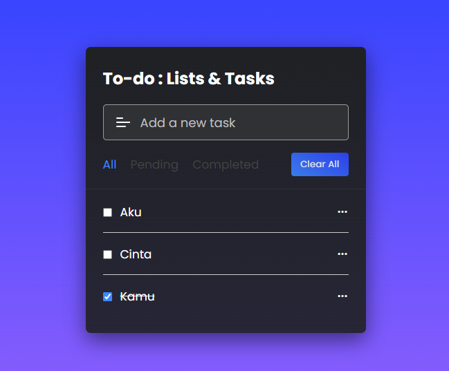

In this project (Image Editor in JavaScript), as you’ve seen in the preview image, users can apply different filters to their image like grayscale, inversion, saturation, and adjust the image brightness. Additionally, users can also rotate or flip the images and save their edited images.

This project is made with vanilla JavaScript. If you’re excited to view a demo of this image editor or want to know what this editor looks like. You can click link that I provided in description to view a live demo of this simple image editor.

---
### 📟 &nbsp;Preview :

- 📫 How to reach me: &nbsp; 

---

### 🛠 &nbsp;Languages and Tools :

 
&nbsp;
&nbsp;
&nbsp;

&nbsp;
&nbsp;

---
### 📑 &nbsp;License:

MIT License

Copyright (c) 2022 Halip26

Permission is hereby granted, free of charge, to any person obtaining a copy
of this software and associated documentation files (the "Software"), to deal
in the Software without restriction, including without limitation the rights
to use, copy, modify, merge, publish, distribute, sublicense, and/or sell
copies of the Software, and to permit persons to whom the Software is
furnished to do so, subject to the following conditions:

The above copyright notice and this permission notice shall be included in all
copies or substantial portions of the Software.

THE SOFTWARE IS PROVIDED "AS IS", WITHOUT WARRANTY OF ANY KIND, EXPRESS OR
IMPLIED, INCLUDING BUT NOT LIMITED TO THE WARRANTIES OF MERCHANTABILITY,
FITNESS FOR A PARTICULAR PURPOSE AND NONINFRINGEMENT. IN NO EVENT SHALL THE
AUTHORS OR COPYRIGHT HOLDERS BE LIABLE FOR ANY CLAIM, DAMAGES OR OTHER
LIABILITY, WHETHER IN AN ACTION OF CONTRACT, TORT OR OTHERWISE, ARISING FROM,
OUT OF OR IN CONNECTION WITH THE SOFTWARE OR THE USE OR OTHER DEALINGS IN THE
SOFTWARE.
